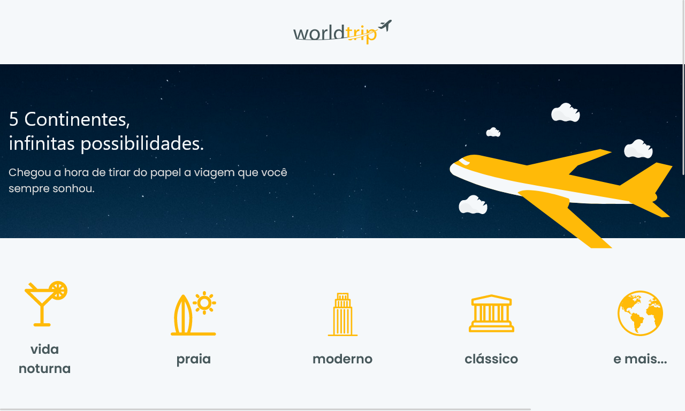

<h1 align="center">
  
</h1>

 

  

## 🚀 Tecnologias

Tecnologias utilizadas no projeto:

- ReactJS
- Next
- Typescript
- Styled Components
- Swiper

 

## 💻 Projeto

O WorldTrip é uma aplicação fictícia para mostrar os lugares mais famosos do mundo separados por continente.

 

## ⚒️ Features

- [x] Carrossel

 

## 🔖 Layout

Layout da aplicação no [figma](https://www.figma.com/file/8QAkMs3BddatXn2fFseyu4/Desafio-1-M%C3%B3dulo-4-ReactJS/duplicate).

 

## 🌐 Deploy

Você pode ver o site clicando <a href="https://worldtrip-silk.vercel.app/" target="_blank">nesse link</a>.

 

## :memo: Licença

Esse projeto está sob a licença MIT. Veja o arquivo <a href="https://github.com/Gabriel-Sousa/worldtrip/blob/main/.github/LICENSE" target="_blank">LICENSE</a>  para mais detalhes.

---

Feito com ♥ por Gabriel Sousa
